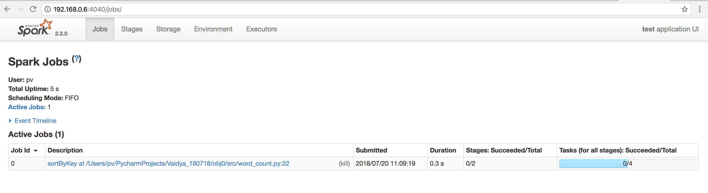

# Objective 0: Environment Setup

### Analytic Environment

The table below outlines the Spark environment setup, along with the versions of the environment, that I have used moving forward in the test:

| **Environment** | **Version** |
| --- | --- | 
| Mac OS | macOS High Sierra Version 10.13.5 |
| Java  | Java HotSpot\(TM\) 64-Bit Server VM, Java 1.8.0\_172 |
| Scala | Scala version 2.11.8 |
| Spark  | Version 2.2.0 |
| Python | Python 3.6.5 |
| PySpark  | py4j-0.10.4 pyspark-2.2.0 |


### Objective 0.1

The github repo can be found at: 


The code follows the structure provided in the instructions. Apart from the instructions, I have created a **utils** package that houses all the reusable modules being used in answering all the questions within the assignment. 



The motivation for creating the utils package is to make sure that the solution follows modular design patterns, and ultimately, enables reusability across projects. The utils package can be exported to another project for use when similar tasks need to be performed. 



### Objective 0.2:

The objective of the application was to:

* Test the Environment
* Count the number of words contained in the [README](https://raw.githubusercontent.com/ToJen/Quorum-Enterprise-Blockchain/master/README.md) of the Quorum-Enterprise-Blockchain project
* Save the Output







The output from Spark can be saved in many ways. In this test, I hav explored two methods:



```python
def write_spark_df_to_csv(self, spark_df):
    """
    Function to write Spark Dataframe to CSV in /out
    :param spark_df: Spark Dataframe
    :return: True, if process is successful
    """
    cwd = os.getcwd()
    cwd = cwd.split('src')[0] + 'out'
    spark_df.write.csv(cwd + "/wordcounts_spark.csv")
```





```python
def write_spark_df_to_pandas_to_csv(self, spark_df):
    """
    Function to write Spark Dataframe to CSV using pandas in /out
    :param spark_df: Spark Dataframe
    :return: True, if process is successful
    """
    cwd = os.getcwd()
    cwd = cwd.split('src')[0] + 'out'
    spark_df.toPandas().to_csv(cwd + "/wordcounts_pandas.csv", index=False)
```






### Appendix

#### Installing Spark Version 2.2.0 with HomeBrew 

By default, Apache Spark version for HomeBrew is 2.3.0. In order to install HomeBrew 2.2.0, I made updates to the apache-spark formula in the formula directory for HomeBrew. 

```ruby
class ApacheSpark < Formula
  desc "Engine for large-scale data processing"
  homepage "https://spark.apache.org/"
  url "https://www.apache.org/dyn/closer.lua?path=spark/spark-2.2.0/spark-2.2.0-bin-hadoop2.7.tgz"
  version "2.2.1"
  sha256 "97fd2cc58e08975d9c4e4ffa8d7f8012c0ac2792bcd9945ce2a561cf937aebcc"
  head "https://github.com/apache/spark.git"

  bottle :unneeded

  depends_on :java => "1.8"

  def install
    # Rename beeline to distinguish it from hive's beeline
    mv "bin/beeline", "bin/spark-beeline"

    rm_f Dir["bin/*.cmd"]
    libexec.install Dir["*"]
    bin.install Dir[libexec/"bin/*"]
    bin.env_script_all_files(libexec/"bin", Language::Java.java_home_env("1.8"))
  end
  test do
    assert_match "Long = 1000", pipe_output(bin/"spark-shell", "sc.parallelize(1 to 1000).count()")
  end
end
```
